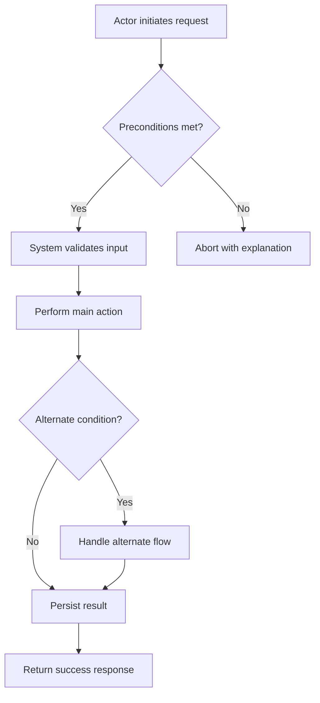
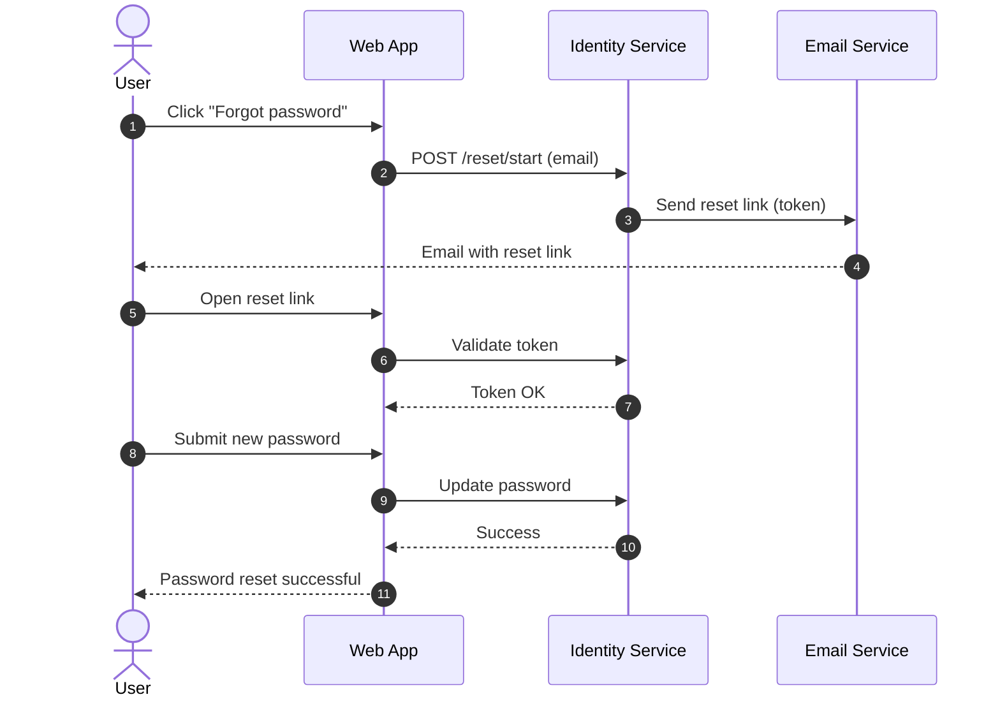

# Use Case Authoring Instructions

## Introduction

This guide standardizes how to author use cases in this repository. It defines a clear, testable structure and includes diagramming guidance using Mermaid. Use it when documenting a single use case (a user goal or system behavior) rather than a full specification.

## Standard Use Case Template (copy-paste ready)

```
# Use Case: <Descriptive Title>

- Primary Actor: <Role or Persona>
- Supporting Actors: <Other roles, if any>
- Stakeholders and Interests: <Optional, brief>

- Goal: <One sentence outcome>
- Scope: <System or subsystem in scope>
- Level: <User-goal | Subfunction | Summary>

- Preconditions:
  1. <Condition>
  2. <Condition>

- Triggers:
  - <Event that starts the use case>

## Main Success Scenario
1. <Actor> <action/result>.
2. <System> <response>.
3. ...
N. <Goal achieved>.

## Alternate/Exception Flows
A1. <Condition>:
   1. <Step>
   2. <Rejoin at step X or ends>.

A2. <Condition>:
   1. <Step>

## Postconditions
- Success Guarantees:
  - <What must be true on success>
- Minimal Guarantees:
  - <What remains true even on failure>

## Business Rules
- <Rule ID or description>

## Non-Functional Notes
- <Performance, security, UX, compliance, etc.>

## Open Issues
- <Questions or TBDs>

## Diagram
- See Mermaid diagram below.
```

## Field-by-field Guidance

- Title: Use an action-oriented phrase that states the outcome (e.g., "Enroll Student in Course").
- Primary Actor: The role initiating the use case (not a specific person).
- Supporting Actors: Roles that assist or are consulted.
- Stakeholders and Interests: Optional—list those affected and what they care about.
- Goal: One crisp sentence; measurable when possible.
- Scope: Name the system or bounded context; avoid enterprise-wide scopes.
- Level:
  - User-goal for end-to-end value.
  - Subfunction for smaller reusable behaviors.
  - Summary for high-level aggregates.
- Preconditions: Facts that must already be true (no implied actions).
- Triggers: The event that starts the scenario (external or time-based).
- Main Success Scenario:
  - 7–12 numbered steps is typical.
  - Each step should be an observable result in present tense, attributed to Actor/System.
  - Avoid UI specifics unless essential to behavior.
- Alternate/Exception Flows:
  - Reference where they branch (e.g., "after step 3").
  - State conditions clearly; specify rejoin step or termination.
- Postconditions:
  - Success guarantees: must hold on success.
  - Minimal guarantees: must hold regardless of success.
- Business Rules: Reference IDs if you have a catalog; otherwise brief descriptions.
- Non-Functional Notes: Only those directly impacting this use case.
- Open Issues: Facts unknown, decisions pending—keep short.

## Mermaid Diagram Guidance

Include one Mermaid diagram per use case that communicates the main flow.

Preferred types:

- UML Use Case Diagram (flowchart style) showing Actor-to-Use Case relationships.
- Sequence Diagram illustrating the Main Success Scenario steps.

Place the diagram under the "Diagram" section using a fenced code block with language `mermaid`.

Example flowchart:



Example sequence diagram:

```mermaid
sequenceDiagram
  autonumber
  participant Actor
  participant UI
  participant Service
  participant DB

  Actor->>UI: Submit request
  UI->>Service: Validate and process
  Service->>DB: Read/Write data
  DB-->>Service: Result
  Service-->>UI: Outcome
  UI-->>Actor: Confirmation
```

Optional Mermaid init (if supported):

```mermaid
%%{init: {"theme": "neutral"}}%%
```

## Example Use Case

Title: Reset User Password

- Primary Actor: End User
- Supporting Actors: Email Service
- Goal: User securely resets their password and can sign in with the new password.
- Scope: Identity Service
- Level: User-goal

- Preconditions:

  1. User has an active account with a verified email.

- Triggers:
  - User selects "Forgot password" from the sign-in page.

### Main Success Scenario

1. User requests a password reset link.
2. System validates the email format and looks up the account.
3. System generates a time-bound, single-use reset token and stores it.
4. System emails a reset link containing the token to the user.
5. User clicks the reset link.
6. System validates the token and presents a new password form with policy hints.
7. User enters a new password that meets policy and submits.
8. System updates the password hash, invalidates all active sessions, and marks the token used.
9. System confirms success and prompts the user to sign in.

### Alternate/Exception Flows

- A1. Unknown email address:

  1. At step 2, no account found.
  2. System responds with a generic message and does not reveal account existence. End.

- A2. Token invalid or expired:
  1. At step 6, token fails validation (expired/used/tampered).
  2. System displays an explanation and offers to resend a new link. Rejoin at step 1.

### Postconditions

- Success Guarantees:
  - Password updated; prior sessions invalidated.
  - Reset token consumed.
- Minimal Guarantees:
  - System does not leak whether an email exists.
  - Failed attempts are rate-limited and logged.

### Business Rules

- Password must meet policy (length, complexity, history).
- Reset tokens expire after 30 minutes and are single-use.

### Non-Functional Notes

- Email delivery within 60 seconds P95.
- Log sensitive events; redact tokens and secrets.

### Open Issues

- Determine exact password history length (e.g., last 5).

### Diagram



## Authoring Checklist

- Title states outcome and actor.
- Goal is one sentence, unambiguous.
- Scope and Level are set appropriately.
- Preconditions and Trigger are explicit.
- Main Success Scenario is numbered, observable, and avoids UI trivia.
- Alternates reference branch/rejoin points.
- Postconditions include success and minimal guarantees.
- Business rules referenced or briefly stated.
- Mermaid diagram included and readable.
- No open issues left unresolved, or they’re listed in "Open Issues".

## Naming and File Conventions

- File name: `use-case-<kebab-case-title>.md` (e.g., `use-case-reset-user-password.md`).
- One use case per file.
- Place diagrams inline as Mermaid code blocks within the file.
- Keep lines under ~120 characters where feasible.

## Tips and Common Pitfalls

- Prefer user goals over UI flows; describe intent, not clicks.
- Avoid hidden system behavior—make side effects explicit.
- Keep alternates focused; don’t duplicate main steps—reference them.
- If a step is conditional, state the condition first.
- Update related business rules when the use case changes.

## Acceptance Criteria

- Contains the template, field guidance, diagram guidance, example, and checklist as specified.
- Is self-contained and immediately actionable for authors.
- Renders correctly as Markdown without external assets.
- Uses clear headings matching the structure above.
