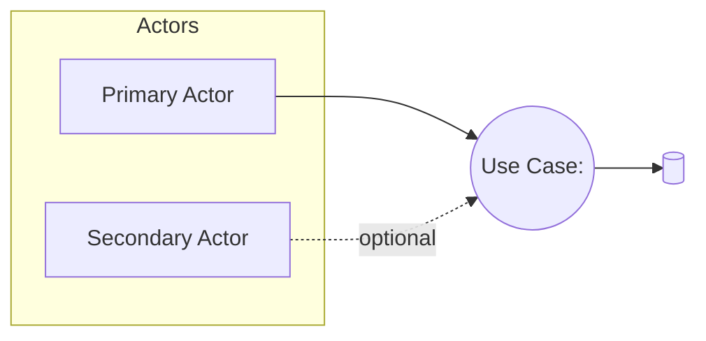
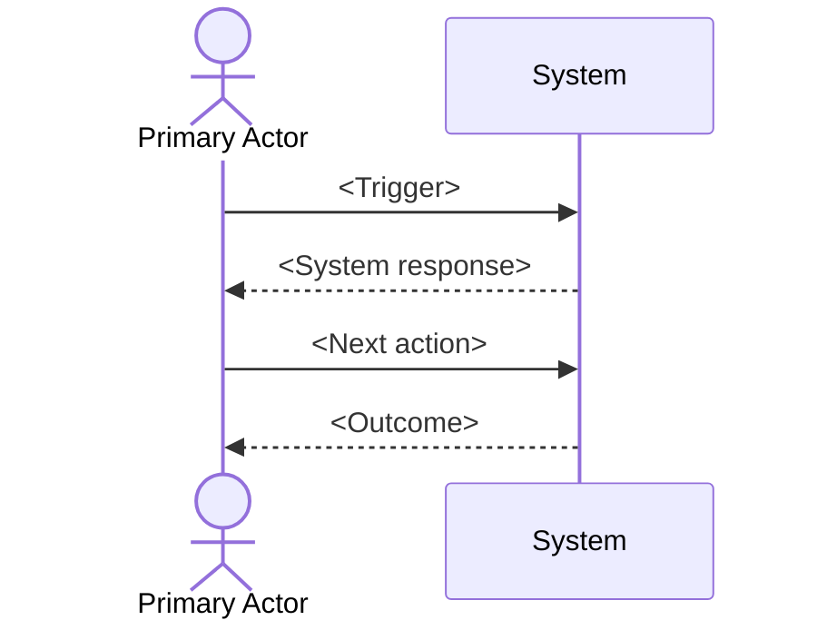

---
prompt_metadata:
  id: create-use-case-instructions
  title: Generate Use Case Authoring Instructions (Markdown)
  description: Generates a Markdown authoring guide for creating use cases with a standard structure and Mermaid diagram guidance.
  owner: johnmillerATcodemag-com
  repository: zeus.academia.3
  version: 1.0.0
  created: 2025-10-14
  updated: 2025-10-14
  output_path: .github/prompts/create-use-case.instructions.md
  category: documentation
  tags: [use-cases, documentation, authoring-guide, mermaid, prompt-generation]
  output_format: markdown
---

# Generate Use Case Authoring Instructions (Markdown)

You are an expert technical writer. Produce a single Markdown instruction file that teaches contributors how to author use cases in this repository, following a standard format and including Mermaid diagram guidance.

## Output requirements

- Create or overwrite the file at `.github/prompts/create-use-case.instructions.md`.
- Output only the final `.github/prompts/create-use-case.instructions.md` content as Markdown. Do not include any additional commentary, wrapper text, or code fences around the whole file.
- The instruction file must be self-contained, readable, and render correctly in Markdown preview.

## Audience and scope

- Audience: Repository contributors authoring use cases.
- Scope: Provide a copy-paste template, field-by-field guidance, Mermaid diagram guidance (flowchart and sequence), one concise example use case, a checklist, file naming conventions, and common pitfalls.

## Structure of the generated instruction file

The generated `.md` file must follow this outline and headings:

1. Title: "Use Case Authoring Instructions"
2. Introduction
3. Standard Use Case Template (copy-paste ready)
4. Field-by-field Guidance
5. Mermaid Diagram Guidance
6. Example Use Case (concise but realistic)
7. Authoring Checklist
8. Naming and File Conventions
9. Tips and Common Pitfalls

## Standard Use Case Template (to include verbatim in the output)

Provide this template as a fenced Markdown block for users to copy:

```
# Use Case: <Descriptive Title>

- Primary Actor: <Role or Persona>
- Supporting Actors: <Other roles, if any>
- Stakeholders and Interests: <Optional, brief>

- Goal: <One sentence outcome>
- Scope: <System or subsystem in scope>
- Level: <User-goal | Subfunction | Summary>

- Preconditions:
  1. <Condition>
  2. <Condition>

- Triggers:
  - <Event that starts the use case>

## Main Success Scenario
1. <Actor> <action/result>.
2. <System> <response>.
3. ...
N. <Goal achieved>.

## Alternate/Exception Flows
A1. <Condition>:
   1. <Step>
   2. <Rejoin at step X or ends>.

A2. <Condition>:
   1. <Step>

## Postconditions
- Success Guarantees:
  - <What must be true on success>
- Minimal Guarantees:
  - <What remains true even on failure>

## Business Rules
- <Rule ID or description>

## Non-Functional Notes
- <Performance, security, UX, compliance, etc.>

## Open Issues
- <Questions or TBDs>

## Diagram
- See Mermaid diagram below.
```

## Field-by-field Guidance (what to write)

- Title: Use an action-oriented phrase that states the outcome (e.g., "Enroll Student in Course").
- Primary Actor: The role initiating the use case (not a specific person).
- Supporting Actors: Roles that assist or are consulted.
- Stakeholders and Interests: Optional—list those affected and what they care about.
- Goal: One crisp sentence; measurable when possible.
- Scope: Name the system or bounded context; avoid enterprise-wide scopes.
- Level:
  - User-goal for end-to-end value.
  - Subfunction for smaller reusable behaviors.
  - Summary for high-level aggregates.
- Preconditions: Facts that must already be true (no implied actions).
- Triggers: The event that starts the scenario (external or time-based).
- Main Success Scenario:
  - 7–12 numbered steps is typical.
  - Each step should be an observable result in present tense, attributed to Actor/System.
  - Avoid UI specifics unless essential to behavior.
- Alternate/Exception Flows:
  - Reference where they branch (e.g., "after step 3").
  - State conditions clearly; specify rejoin step or termination.
- Postconditions:
  - Success guarantees: must hold on success.
  - Minimal guarantees: must hold regardless of success.
- Business Rules: Reference IDs if you have a catalog; otherwise brief descriptions.
- Non-Functional Notes: Only those directly impacting this use case.
- Open Issues: Facts unknown, decisions pending—keep short.

## Mermaid Diagram Guidance

Include one Mermaid diagram per use case that communicates the main flow.

Preferred types:

- UML Use Case Diagram (flowchart style) showing Actor-to-Use Case relationships.
- Sequence Diagram illustrating the Main Success Scenario steps.

Place the diagram under the "Diagram" section using a fenced code block with language `mermaid`.

Example flowchart:


Example sequence diagram:

```mermaid
sequenceDiagram
  autonumber
  participant Actor
  participant UI
  participant Service
  participant DB

  Actor->>UI: Submit request
  UI->>Service: Validate and process
  Service->>DB: Read/Write data
  DB-->>Service: Result
  Service-->>UI: Outcome
  UI-->>Actor: Confirmation
```

Optional Mermaid init (if supported):

```mermaid
%%{init: {"theme": "neutral"}}%%
```

## Example Use Case

Provide a short, realistic example filled in using the template. Choose a generic case like "Reset User Password" unless domain-specific knowledge is required. Include 6–9 main steps, 1–2 alternate flows, and one Mermaid diagram (either flowchart or sequence).

## Authoring Checklist

- Title states outcome and actor.
- Goal is one sentence, unambiguous.
- Scope and Level are set appropriately.
- Preconditions and Trigger are explicit.
- Main Success Scenario is numbered, observable, and avoids UI trivia.
- Alternates reference branch/rejoin points.
- Postconditions include success and minimal guarantees.
- Business rules referenced or briefly stated.
- Mermaid diagram included and readable.
- No open issues left unresolved, or they’re listed in "Open Issues".

## Naming and File Conventions

- File name: `use-case-<kebab-case-title>.md` (e.g., `use-case-reset-user-password.md`).
- One use case per file.
- Place diagrams inline as Mermaid code blocks within the file.
- Keep lines under ~120 characters where feasible.

## Tips and Common Pitfalls

- Prefer user goals over UI flows; describe intent, not clicks.
- Avoid hidden system behavior—make side effects explicit.
- Keep alternates focused; don’t duplicate main steps—reference them.
- If a step is conditional, state the condition first.
- Update related business rules when the use case changes.

## Acceptance criteria for the generated instruction file

- Contains the template, field guidance, diagram guidance, example, and checklist as specified.
- Is self-contained and immediately actionable for authors.
- Renders correctly as Markdown without external assets.
- Uses clear headings matching the structure above.


# Prompt: Generate Use Case Authoring Instructions (Markdown)

You are an expert business analyst and technical writer. Create a clear, actionable instruction file (Markdown) that contributors will use to author use cases in this repository.

---

prompt_metadata:
id: create-use-case-instructions
title: Generate Use Case Authoring Instructions (Markdown)
description: Generates a Markdown guide and template for authoring use cases with Mermaid diagram requirements.
owner: johnmillerATcodemag-com
repository: zeus.academia.3
version: 1.0.0
created: 2025-10-14
updated: 2025-10-14
output_path: use-cases/INSTRUCTIONS.md
category: documentation
tags: [use-cases, documentation, mermaid]
output_format: markdown

---

# Prompt: Generate Use Case Authoring Instructions (Markdown)

You are an expert business analyst and technical writer. Create a clear, actionable instruction file (Markdown) that contributors will use to author use cases in this repository.

## Output requirements

- Create or overwrite the file at: `use-cases/INSTRUCTIONS.md`.
- Format the output strictly as Markdown with headings and lists.
- Include a short, friendly introduction explaining the purpose of the guide and when to use it.
- Provide a table of contents.

## Audience

- Contributors who will document use cases as Markdown files in the `use-cases/` folder.

## Scope

- Focus on the standard use case format and how to represent the use case with a Mermaid diagram.
- Provide a reusable template authors can copy/paste for each new use case.

## Standard use case template

Include the following sections with concise guidance beneath each heading. Provide a copy-paste-ready template block and a filled-in example after it.

- Title: Use Case Name
- Use Case ID: Short, stable identifier (e.g., UC-001)
- Scope: The system or subsystem under consideration
- Level: User-goal | Summary | Subfunction
- Primary Actor: Role initiating the use case
- Supporting/Secondary Actors: Other interacting roles (if any)
- Stakeholders & Interests: Key stakeholders and what they care about
- Preconditions: What must already be true
- Minimal Guarantees: What is guaranteed even on failure
- Success Guarantees: What is guaranteed on success (postconditions)
- Trigger: Event that starts the use case
- Main Success Scenario: Numbered steps from trigger to goal
- Extensions / Alternate Flows: Labeled by the step they branch from (e.g., 3a, 3b)
- Special Requirements: Non-functional or constraints (performance, security, compliance)
- Data Variations / Technology Variations List: Notable variants or platform specifics
- Frequency of Occurrence: Rough expected frequency
- Open Issues: Known TBDs or risks
- Notes: Any additional context

Provide a fenced template authors can copy:

```markdown
# <Use Case Name>

- Use Case ID: <UC-###>
- Scope: <System/Sub-system>
- Level: <User-goal | Summary | Subfunction>
- Primary Actor: <Role>
- Supporting/Secondary Actors: <Roles>
- Stakeholders & Interests:
  - <Stakeholder>: <Interest>

## Preconditions

- <Precondition 1>

## Minimal Guarantees

- <Minimal guarantee 1>

## Success Guarantees

- <Success guarantee 1>

## Trigger

- <Triggering event>

## Main Success Scenario

1. <Step 1>
2. <Step 2>

## Extensions / Alternate Flows

- 2a. <Condition>: <Alternate step>

## Special Requirements

- <NFR or constraint>

## Data/Technology Variations

- <Variation>

## Frequency of Occurrence

- <Frequency>

## Open Issues

- <Issue>

## Notes

- <Additional context>
```

## Mermaid diagram requirements

Include instructions for authors to add at least one Mermaid diagram per use case. Provide both a relationship view and a scenario view option, with ready-to-edit examples.

- Always include a Mermaid diagram immediately after the template header.
- The diagram must be inside a fenced code block with language `mermaid`.
- Choose one or both of the patterns below:

Option A — Actor-to-Use-Case relationship (flowchart):



Option B — Main Success Scenario (sequence diagram):



Tips:

- Keep labels short; elaborate in text sections.
- Use the sequence diagram to mirror the Main Success Scenario steps.
- For complex branching, create a second diagram for a key alternate flow.

## File naming and placement

- Store each use case as a Markdown file in `use-cases/`.
- Use kebab-case filenames mirroring the title, prefixed with the ID (e.g., `UC-001-enroll-in-course.md`).

## Example (brief)

Provide a brief, realistic example use case using the template and including one Mermaid diagram.

## Quality checklist

Include a checklist at the end authors can quickly scan before submitting:

- Title, ID, Scope, Level, and Actors are present and clear.
- Preconditions, Minimal Guarantees, and Success Guarantees are stated.
- Main Success Scenario is numbered and complete.
- Extensions are tied to specific steps (e.g., 3a).
- At least one Mermaid diagram included and renders.
- No sensitive data or credentials.
- File named and placed correctly.

## Style and conventions

- Write in concise, active voice.
- Use consistent terminology for actors and systems.
- Prefer present tense and imperative mood in steps.
- Use lists for readability; avoid long paragraphs.

## Deliverable

Output only the final `use-cases/INSTRUCTIONS.md` content in Markdown, ready to be saved as-is. Do not include any additional commentary outside the document.
