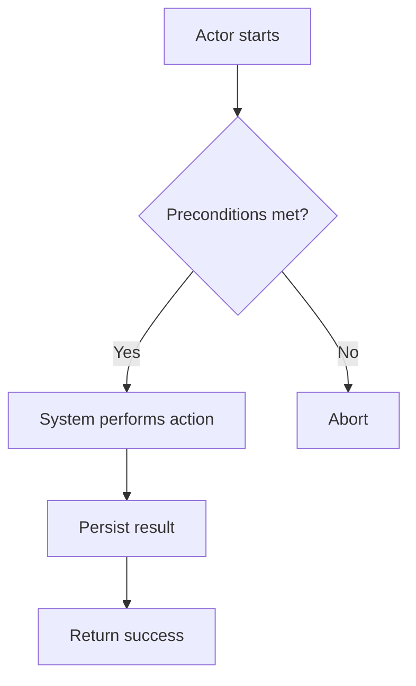

---
prompt_metadata:
  id: derive-use-cases-from-academia
  title: Generate Use Cases from academia.txt (ORM rules)
  description: Derive use cases from the business rules in Model/orm/academia.txt and generate one Markdown file per use case under Model/use-cases, plus an index file.
  owner: johnmillerATcodemag-com
  repository: zeus.academia.3
  version: 1.0.0
  created: 2025-10-14
  updated: 2025-10-14
  output_path: Model/use-cases/derived-use-cases.index.md
  category: documentation
  tags: [use-cases, orm, modeling, mermaid, automation]
  output_format: markdown
---

# Generate Use Cases from academia.txt (ORM rules)

You are an expert analyst and technical writer. Read the business rules from `Model/orm/academia.txt`, derive a clear set of user-goal use cases, and generate a complete set of use case files for this repository.

## Inputs and references

- Source rules: `Model/orm/academia.txt`
- Use case authoring guide: `.github/instructions/create-use-case.instructions.md`
- Instruction-file standards: `.github/instructions/instruction-standards.instruction.md`
- AI-assisted output policy: `.github/instructions/ai-assisted-output.instructions.md`
- Project README: `README.md`

## Output requirements

- Create or overwrite the index file at: `Model/use-cases/derived-use-cases.index.md`.
- Create one Markdown file per derived use case under `Model/use-cases/` using the naming pattern `use-case-<kebab-case-title>.md`.
- Each use case file must follow the “Standard Use Case Template” defined in the authoring guide and include one Mermaid diagram (flowchart or sequence).
- Store use case files under `Model/use-cases/` only; one use case per file.
- Update the top-level `README.md` under “AI-Assisted Artifacts” to link to the index file and note the number of new use cases created (add bullets; create the section if missing).
- Output only the final Markdown for the index file. Do not include any extra commentary outside the document.

## Process (what to do)

1. Parse `Model/orm/academia.txt` and extract atomic business rules and key terms.
2. Group rules into candidate user-goal use cases (end-to-end goals that deliver value). Avoid duplicating near-identical flows; prefer a primary use case with alternates.
3. Produce a candidate list with short titles and one-line goals. Refine for clarity and scope boundaries (system vs. external actors).
4. For each approved candidate:
   - Create `Model/use-cases/use-case-<kebab>.md`.
   - Use the repository use case template and field guidance.
   - Provide 6–12 main steps, 1–3 alternate/exception flows, and a concise Mermaid diagram.
   - Use domain terms and actors consistent with the rules.
5. Build `Model/use-cases/derived-use-cases.index.md` with a table summarizing: ID (e.g., UC-001), Title, Goal (1 line), and Filename (relative link).
6. Update `README.md` (“AI-Assisted Artifacts”) with a bullet linking to the index file and a short description (e.g., “Derived N use cases from academia.txt”).

## File naming and conventions

- Use-case files: `Model/use-cases/use-case-<kebab-case-title>.md`.
- Title inside each file: `# Use Case: <Descriptive Title>`.
- Actors as roles (not named individuals).
- Keep lines ≲ 120 chars when practical.

## Use case template (copy/paste into each file)

````
# Use Case: <Descriptive Title>

- Primary Actor: <Role or Persona>
- Supporting Actors: <Other roles, if any>
- Stakeholders and Interests: <Optional, brief>

- Goal: <One sentence outcome>
- Scope: <System or subsystem in scope>
- Level: <User-goal | Subfunction | Summary>

- Preconditions:
  1. <Condition>
  2. <Condition>

- Triggers:
  - <Event that starts the use case>

## Main Success Scenario
1. <Actor> <action/result>.
2. <System> <response>.
3. ...
N. <Goal achieved>.

## Alternate/Exception Flows
A1. <Condition>:
   1. <Step>
   2. <Rejoin at step X or ends>.

A2. <Condition>:
   1. <Step>

## Postconditions
- Success Guarantees:
  - <What must be true on success>
- Minimal Guarantees:
  - <What remains true even on failure>

## Business Rules
- <Rule ID or description>

## Non-Functional Notes
- <Performance, security, UX, compliance, etc.>

## Open Issues
- <Questions or TBDs>

## Diagram


## Acceptance criteria

- An index file exists at `Model/use-cases/derived-use-cases.index.md` with a table of all derived use cases and links to each file.
- Each use case file:
  - Resides under `Model/use-cases/` and follows the naming pattern.
  - Conforms to the template and guidance; includes one Mermaid diagram.
  - Uses consistent domain terminology from `academia.txt`.
- `README.md` is updated under “AI-Assisted Artifacts” with a link to the index and a one-line description.
- No extra commentary outside the generated files.

## Deliverable

- Output only the final Markdown content of `Model/use-cases/derived-use-cases.index.md`. Create all other files as edits without printing their contents.
```
