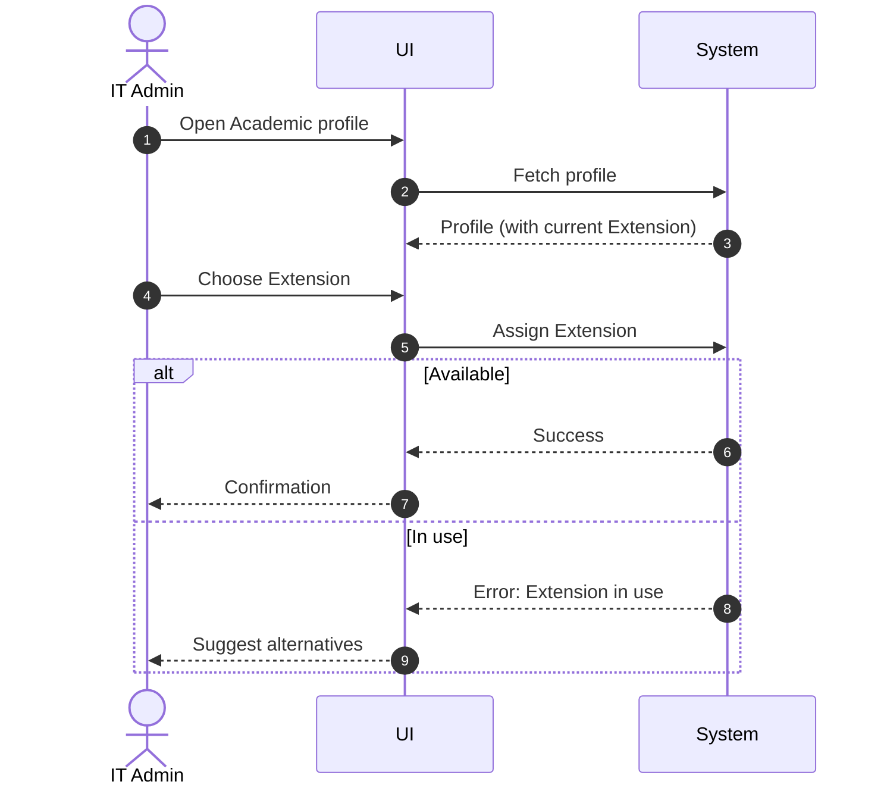

# Use Case: Assign Extension to Academic

- Primary Actor: IT Admin
- Supporting Actors: None
- Stakeholders and Interests: Academics (direct dialing), IT (resource uniqueness)

- Goal: Assign an available phone extension to an Academic.
- Scope: Telephony/Directory Subsystem
- Level: User-goal

- Preconditions:

  1. Academic exists (empNr known).
  2. Extension is available (not currently assigned).

- Triggers:
  - New Academic onboarding or extension change request.

## Main Success Scenario

1. IT Admin searches Academic by empNr or name.
2. System displays Academic profile including current Extension (if any).
3. IT Admin selects an available Extension.
4. System verifies the Extension isn’t assigned to another Academic.
5. System links the Extension to the Academic.
6. System confirms assignment and updates directories.

## Alternate/Exception Flows

A1. Extension already in use:

1.  At step 4, another Academic uses the Extension.
2.  System blocks assignment and suggests available Extensions. Rejoin at step 3.

A2. Academic already has an Extension:

1.  At step 2, Academic has an Extension.
2.  IT Admin chooses to reassign; System unlinks old Extension before assigning the new one. Rejoin at step 3.

## Postconditions

- Success Guarantees:
  - Academic uses exactly one Extension.
- Minimal Guarantees:
  - Each Extension is used by at most one Academic.

## Business Rules

- Each Academic uses exactly one Extension.
- Each Extension is used by at most one Academic.

## Non-Functional Notes

- Propagate changes to directory services within 1 minute (P95).

## Open Issues

- None.

## Diagram

