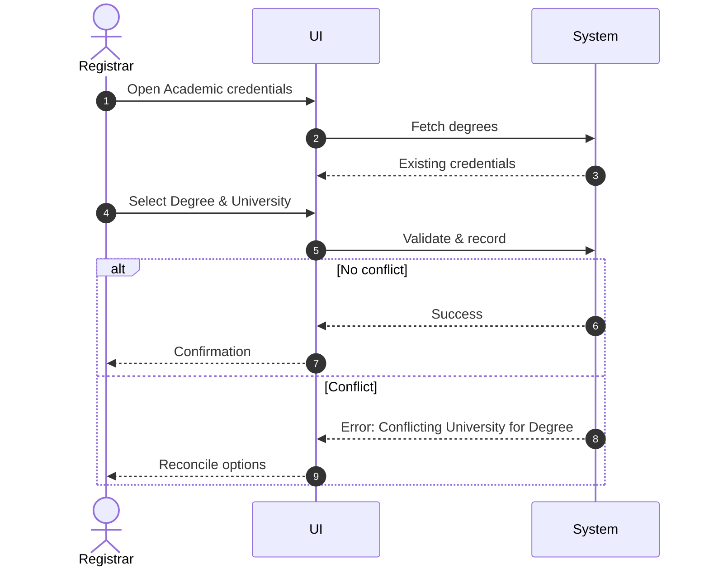

# Use Case: Record Degree and University for Academic

- Primary Actor: Registrar
- Supporting Actors: None
- Stakeholders and Interests: Academics (credential accuracy), University (reputation), HR (eligibility)

- Goal: Record that an Academic obtained a Degree from a University.
- Scope: Registrar/HR Subsystems
- Level: User-goal

- Preconditions:

  1. Academic exists (empNr known).
  2. Degree and University codes are known.

- Triggers:
  - Credential verification or profile completion.

## Main Success Scenario

1. Registrar searches the Academic by empNr.
2. System shows existing degrees (if any).
3. Registrar selects Degree and University.
4. System validates codes.
5. System ensures that for the given Academic and Degree there isn’t already a different University recorded.
6. System records the association.
7. System confirms and logs the change.

## Alternate/Exception Flows

A1. Conflicting University for the same Degree:

1.  At step 5, a different University exists for the same Degree.
2.  System rejects and suggests reconciliation options. End.

A2. Missing Degree/University code:

1.  At step 4, validation fails.
2.  System prompts for valid codes. Rejoin at step 3.

## Postconditions

- Success Guarantees:
  - Academic has an association of Degree from University.
- Minimal Guarantees:
  - No conflicting records are created.

## Business Rules

- For each Academic and Degree, at most one University.
- Each Academic obtained some Degree from some University.

## Non-Functional Notes

- Support auditing of credential records.

## Open Issues

- None.

## Diagram

