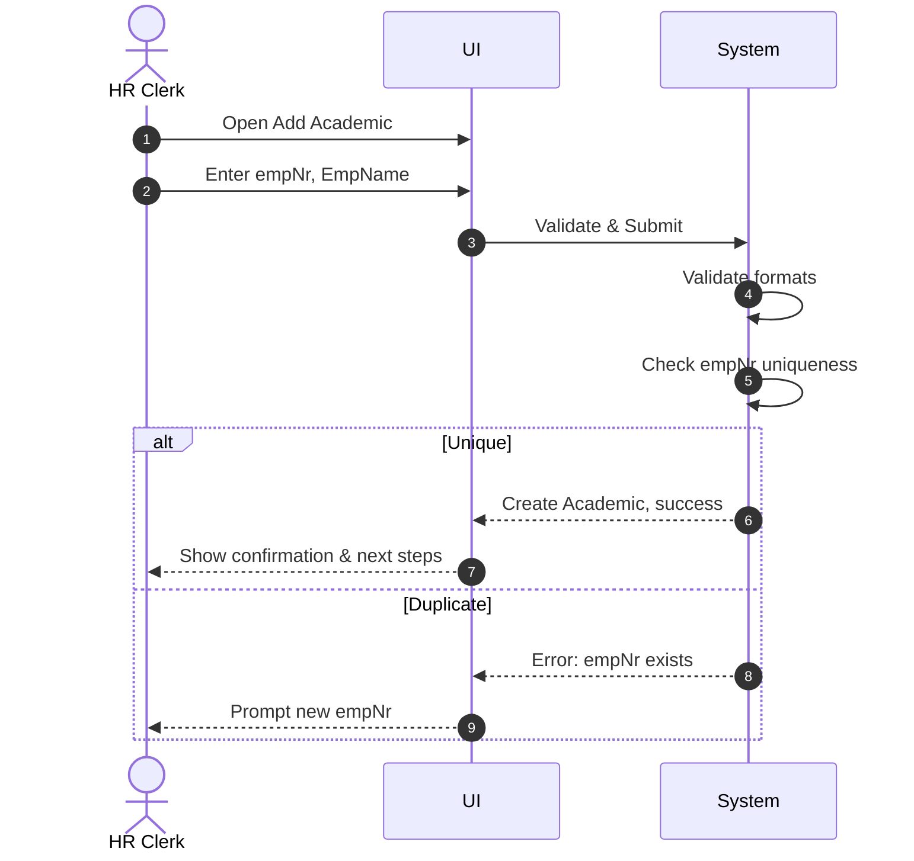

# Use Case: Register New Academic

- Primary Actor: HR Clerk
- Supporting Actors: None
- Stakeholders and Interests: HR (accurate records), IT (consistent IDs)

- Goal: Add a new Academic with a unique employee number and name.
- Scope: Identity/HR Subsystem
- Level: User-goal

- Preconditions:

  1. Actor is authorized to manage Academic records.
  2. A unique employee number (empNr) is available.

- Triggers:
  - A new academic is hired and must be onboarded.

## Main Success Scenario

1. HR Clerk opens the "Add Academic" form.
2. HR Clerk enters empNr (fixed-length 6) and EmpName (≤ 15 chars).
3. System validates formats (lengths, character sets).
4. System checks that empNr is not already in use.
5. System creates the Academic with the provided EmpName and empNr.
6. System confirms creation and shows next-step prompts (assign Rank, Extension, etc.).
7. System logs the creation event.

## Alternate/Exception Flows

A1. empNr already exists:

1.  At step 4, duplicate found.
2.  System rejects with a message and suggests a different empNr. End.

A2. Invalid field formats:

1.  At step 3, validation fails.
2.  System highlights invalid fields and prevents submission. Rejoin at step 2.

## Postconditions

- Success Guarantees:
  - Academic exists with exactly one EmpName and empNr.
- Minimal Guarantees:
  - No partial record persists on failure.

## Business Rules

- Academic has empNr (Text, Fixed Length 6).
- Each Academic has exactly one EmpName (Text, Variable Length 15).

## Non-Functional Notes

- Audit creation events; enforce input validation at server and client layers.

## Open Issues

- None.

## Diagram

