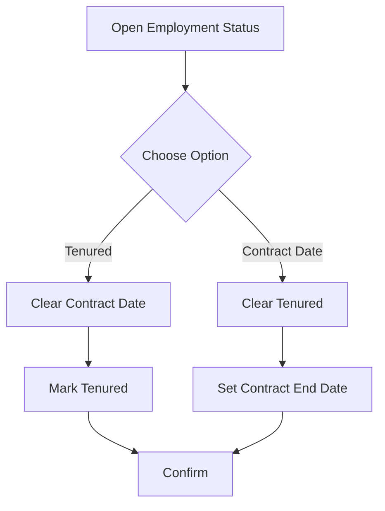

# Use Case: Set Academic Employment Status (Tenured or Contract End Date)

- Primary Actor: HR Clerk
- Supporting Actors: None
- Stakeholders and Interests: Academics (employment clarity), HR (policy compliance)

- Goal: Set an Academic as tenured or set a contract end date, ensuring exclusivity.
- Scope: HR Subsystem
- Level: User-goal

- Preconditions:

  1. Academic exists (empNr known).
  2. Actor is authorized to modify employment status.

- Triggers:
  - Tenure decision or contract update.

## Main Success Scenario

1. HR Clerk opens Academic employment status.
2. System shows current status (tenured or contract end date, if any).
3. HR Clerk selects one of: mark as Tenured, or set Contract End Date.
4. If Tenured is selected, System clears any existing Contract End Date and marks as Tenured.
5. If Contract End Date is selected, System clears Tenured flag and sets the Date.
6. System confirms update and logs changes.

## Alternate/Exception Flows

A1. Invalid date format:

1.  At step 5, date fails validation.
2.  System rejects and prompts for a valid Date (Temporal: Date). Rejoin at step 3.

## Postconditions

- Success Guarantees:
  - For each Academic, at most one holds: Tenured or Contract End Date (never both).
- Minimal Guarantees:
  - No partial status persists on failure.

## Business Rules

- Academic is tenured (at most once per population instance).
- Each Academic is contracted until at most one Date.
- For each Academic, at most one of: is tenured; is contracted until some Date.

## Non-Functional Notes

- Log status changes for audit.

## Open Issues

- None.

## Diagram

