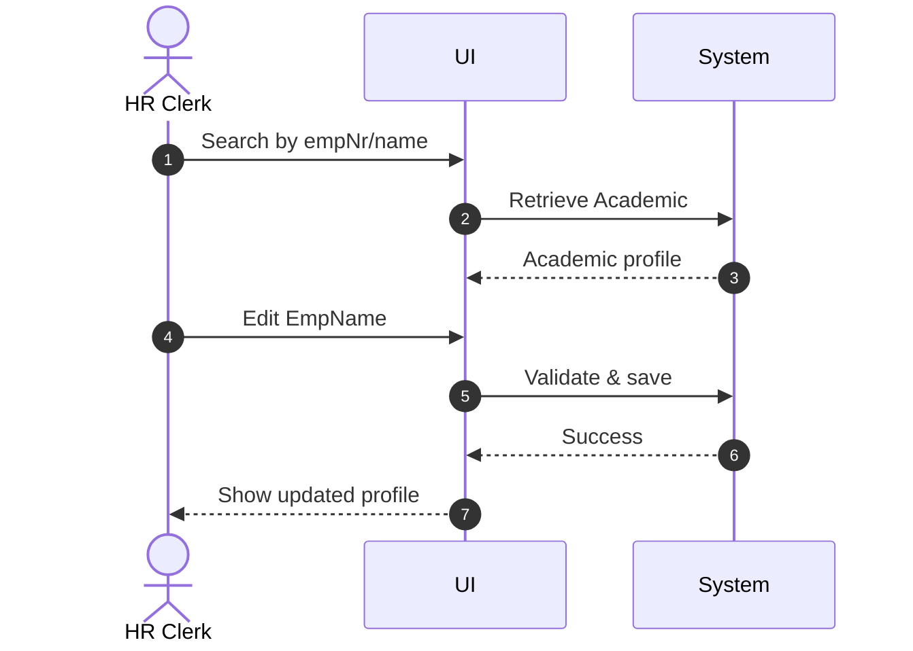

# Use Case: Update Academic Name

- Primary Actor: HR Clerk
- Supporting Actors: None
- Stakeholders and Interests: Academics (correct identity), HR (data accuracy)

- Goal: Change an Academic's EmpName while preserving identification by empNr.
- Scope: Identity/HR Subsystem
- Level: User-goal

- Preconditions:

  1. Academic record exists (empNr known).
  2. Actor is authorized to update names.

- Triggers:
  - Name correction or legal name change request.

## Main Success Scenario

1. HR Clerk searches Academic by empNr or name.
2. System retrieves and displays the Academic profile.
3. HR Clerk selects "Edit Name" and enters new EmpName (≤ 15 chars).
4. System validates length and characters.
5. System updates the EmpName.
6. System confirms update and logs the change.
7. System displays the updated profile.

## Alternate/Exception Flows

A1. Academic not found:

1.  At step 2, no record matches.
2.  System informs the clerk and suggests search tips. End.

A2. Invalid name length:

1.  At step 4, validation fails (exceeds 15 chars).
2.  System shows error; HR Clerk shortens name. Rejoin at step 3.

## Postconditions

- Success Guarantees:
  - Academic retains empNr; new EmpName is stored.
- Minimal Guarantees:
  - No partial update persists on failure.

## Business Rules

- EmpName is a value type (Text, Variable Length 15).

## Non-Functional Notes

- Track change history for auditing.

## Open Issues

- None.

## Diagram

