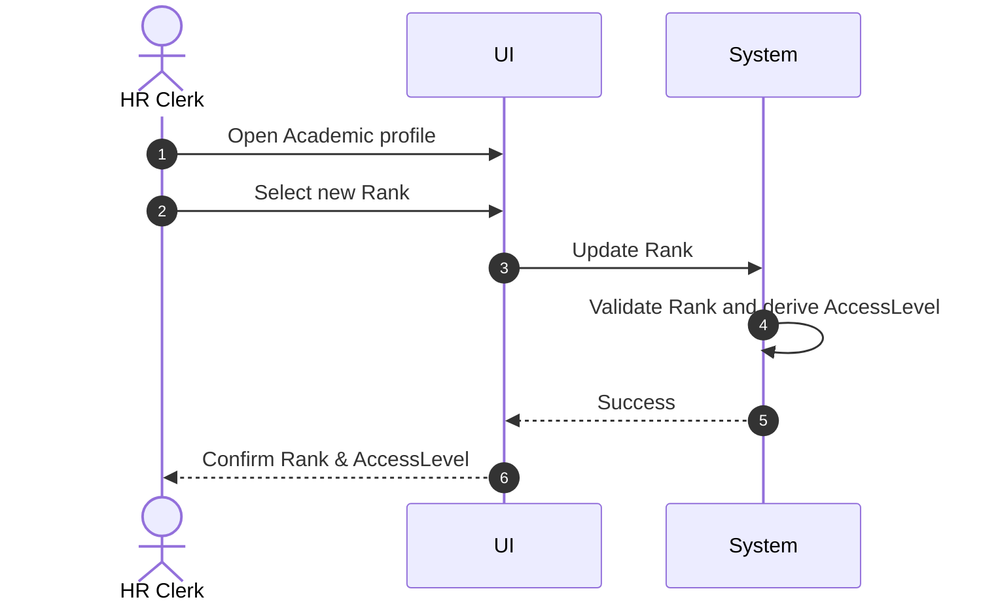

# Use Case: Update Academic Rank

- Primary Actor: HR Clerk
- Supporting Actors: None
- Stakeholders and Interests: Academics (career status), Security (access control)

- Goal: Change an Academic’s Rank and ensure the corresponding AccessLevel is enforced.
- Scope: HR/Security Subsystems
- Level: User-goal

- Preconditions:

  1. Academic exists (empNr known).
  2. Valid Rank value is known (P, SL, L).

- Triggers:
  - Promotion or demotion event.

## Main Success Scenario

1. HR Clerk opens the Academic profile.
2. HR Clerk selects a new Rank (P, SL, or L).
3. System validates Rank value.
4. System updates the Academic’s Rank.
5. System derives and applies the ensured AccessLevel from Rank.
6. System confirms update and logs changes.

## Alternate/Exception Flows

A1. Invalid Rank value:

1.  At step 3, validation fails.
2.  System displays allowed values (P, SL, L). Rejoin at step 2.

## Postconditions

- Success Guarantees:
  - Academic has exactly one Rank at any time.
  - AccessLevel ensured by the new Rank is in effect.
- Minimal Guarantees:
  - Prior state is unchanged if update fails.

## Business Rules

- Each Academic has exactly one Rank; possible Rank values are P, SL, L.
- Rank ensures exactly one AccessLevel (P→INT, SL→NAT, L→LOC).

## Non-Functional Notes

- Propagate access changes to downstream systems promptly.

## Open Issues

- None.

## Diagram

